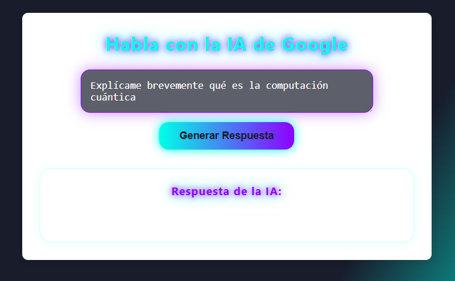
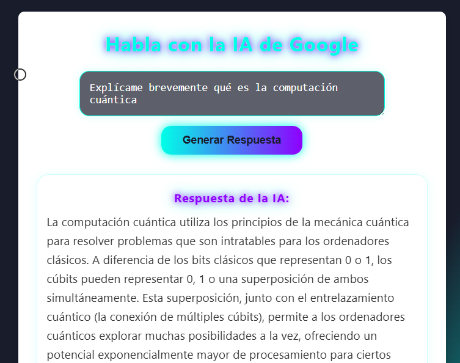
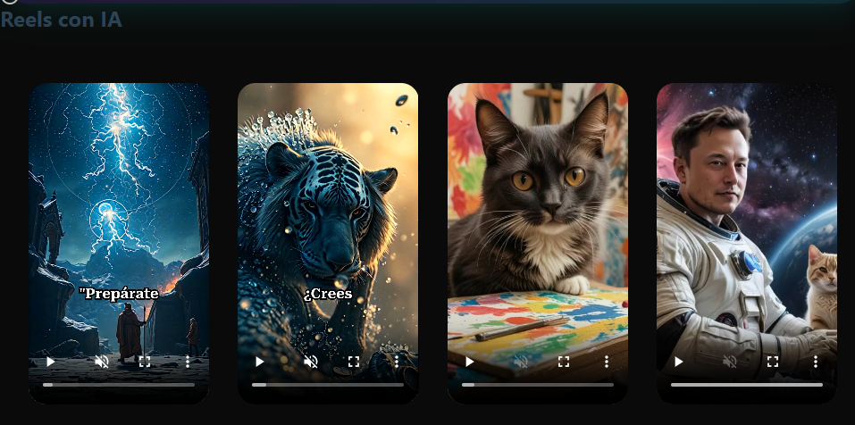
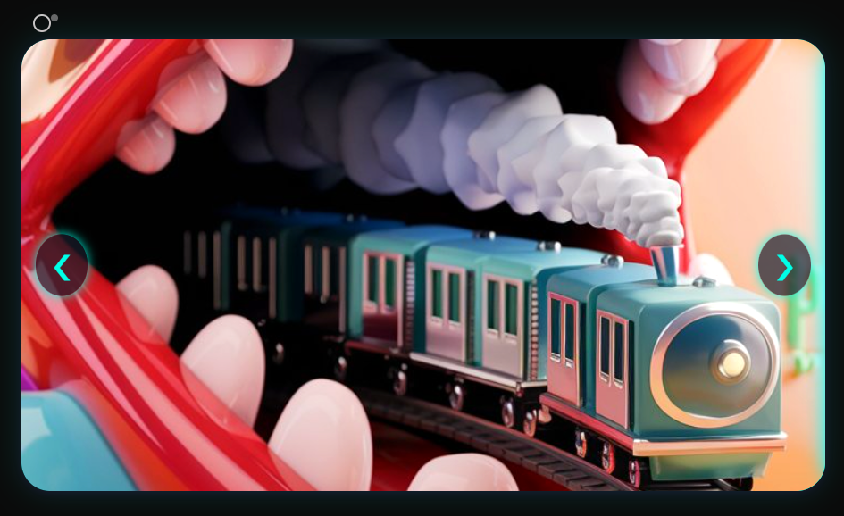
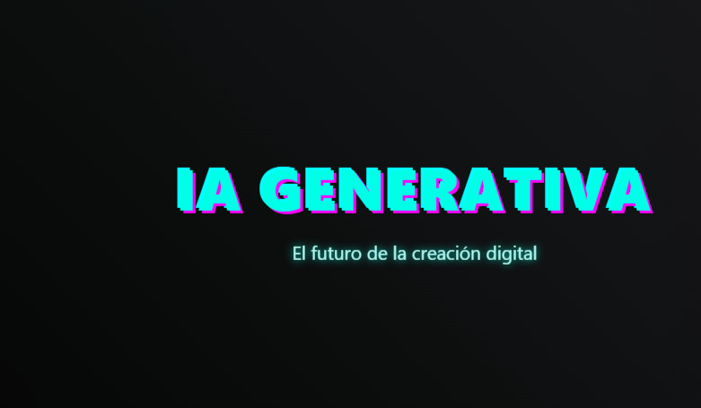

# 🤖 Mi Asistente de IA con Gemini y Node.js

Este proyecto es una aplicación web sencilla que permite a los usuarios interactuar con la inteligencia artificial de Google Gemini para generar texto a partir de un Prompt. El **frontend** está construido con HTML, CSS y JavaScript, mientras que el **backend** (servidor) en Node.js se encarga de comunicarse de forma segura con la API de Google Gemini.

## 🚀 Demo

Aquí puedes ver una captura de pantalla de la aplicación en acción:


_Figura 1: Interfaz de usuario de la aplicación con un ejemplo de pregunta._

La respuesta de la IA se muestra dinámicamente:


_Figura 2: La respuesta de la IA se visualiza en la sección de salida._

---

## ✨ Características

- **Interfaz de Usuario Sencilla:** Un campo de texto para introducir prompts y un área para mostrar las respuestas.
- **Integración con Google Gemini:** Utiliza la API de Gemini (modelos como `gemini-pro` o `gemini-flash`) para generar respuestas inteligentes.
- **Separación de Frontend y Backend:** Permite una gestión segura de la clave de API.

---

## 🛠️ Tecnologías Utilizadas

**Frontend:**

- **HTML5:** Estructura de la página.
- **CSS3:** Estilos y diseño.
- **JavaScript:** Lógica interactiva y comunicación con el backend.

**Backend:**

- **Node.js:** Entorno de ejecución para el servidor.
- **Express.js:** Framework web para Node.js.
- **@google/generative-ai:** Librería oficial de Google para interactuar con la API de Gemini.
- **dotenv:** Para gestionar variables de entorno (como la API Key).
- **cors:** Para manejar las políticas de seguridad

---

## 🛠️ Otras secciones del Sitio

- **Reels creados con IA**
- **Carrusel Futurista de Imágenes creadas con IA**
- **Galería de Prompts**


_Figura 3: Reels creados con IA._


_Figura 4: Carrousel de Imágenes creadas con IA._



## ⚙️ Proceso de Configuración y Ejecución (Rápido y Sencillo)

Para que esta aplicación funcione en tu entorno local, necesitarás configurar tanto el frontend como el backend.

### 1. Clona el Repositorio

```bash
git clone https://github.com/katiuskamartinez/creativity
```

### 2. Configuración del Backend (Servidor Node.js)

Navega a la carpeta del backend:

```bash
cd mi-ia-web-backend
```

Instala las dependencias:

```bash
npm install express @google/generative-ai dotenv cors
```

### 3. Configura tu Clave de API de Google

- Obtén tu Google API Key desde Google AI Studio o Google Cloud Console.
- Crea un archivo llamado `.env` en la raíz de la carpeta `mi-ia-web-backend` (al mismo nivel que `server.js` y `package.json`).
- Dentro de `.env`, añade tu clave de API de la siguiente manera:

```env
GOOGLE_API_KEY=TU_CLAVE_DE_API_DE_GOOGLE_AQUI
```

### 4. Inicia el servidor backend

```bash
node server.js
```

Deberías ver un mensaje en tu terminal indicando que el servidor está escuchando en `http://localhost:3000`.

### 5. Abre `index.html` en tu navegador

Abre el archivo `index.html` del frontend en tu navegador preferido.

### 6. Prueba la Aplicación

- Con el servidor backend corriendo en tu terminal y el `index.html` abierto en el navegador:
  - Introduce un prompt o pregunta en el área de texto.
  - Haz clic en el botón **"Generar Respuesta"**.
  - La respuesta de la IA debería aparecer en la sección de salida.
